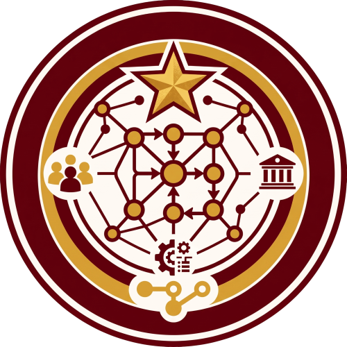

# INTERNCONNECT: Integrated On-the-Job Training Information Management System (OJTIMS)

<p align="center">
  
</p>

<p align="center">
  <strong>A Centralized, Multi-Tier OJT Lifecycle & Practicum Management Platform</strong><br>
  <em>Polytechnic University of the Philippines – Taguig Branch</em>
</p>

<p align="center">
  <a href="https://php.net"></a>
  <a href="https://laravel.com"></a>
  <a href="https://mysql.com"></a>
  <a href="https://ai.google.dev"></a>
  <a href="https://hostinger.com"></a>
</p>

---

## 📌 Table of Contents
- [Project Overview](#-project-overview)
- [Key Features](#-key-features)
- [System Architecture](#-system-architecture)
- [External System Integrations](#-external-system-integrations)
- [Technology Stack](#-technology-stack)
- [Directory Structure](#-directory-structure)
- [Installation & Local Setup](#-installation--local-setup)
- [Production Deployment](#-production-deployment)
- [Security & Compliance](#-security--compliance)
- [API Documentation](#-api-documentation)
- [Authors & Acknowledgments](#-authors--acknowledgments)

---

## 📖 Project Overview

**INTERNCONNECT (OJTIMS)** is an enterprise academic web application designed to digitize, streamline, and govern the complete On-the-Job Training (OJT) practicum lifecycle at **PUP Taguig Campus**.

The platform replaces fragmented, paper-based, and unintegrated procedures by unifying student compliance tracking, Memorandum of Agreement (MOA) partner legal management, tokenized supervisor performance evaluations, and macro administrative reporting into a secure, four-tier web ecosystem.

---

## ✨ Key Features

### 👨‍🎓 1. 2-Phase Gated Document Engine (Students)
* **Phase 1 (Basic Requirements):** Prerequisite clearances (*Resume, Medical Clearance, Consent Form, Good Moral, Endorsement & Acceptance Letters, Notarized MOA*).
* **Phase 2 (Other Requirements):** Ongoing and completion deliverables (*DTRs, Weekly Reports, Certificate of Completion, Final Narrative*). **Gated and locked by default** until Phase 1 is 100% verified.
* **Real-time Status Monitoring:** Live compliance progress checklist with approval and denial remarks.

### 👨‍🏫 2. Virtual Classrooms & In-Browser Review (Professors)
* **Classroom Management:** Section rosters organized by School Year and Semester.
* **In-Browser Document Review:** PDF inspection with bulk approvals and mandatory rejection feedback loops.
* **Evaluation Validation & Grade Release:** Audits supervisor scores and formally releases grades to student records.

### 📋 3. MOA & Institutional Governance (Coordinators)
* **Centralized MOA Repository:** Database of accredited Host Training Establishments (HTEs) and scanned notarized contracts.
* **Automated Expiry & Renewal Alerts:** Color-coded validity badges and automated email alerts sent to partner companies via SMTP.
* **MOA Lock & Unlock Workflow:** Tamper-resistant document lock with audited student unlock requests.
* **Reporting Engine:** Generates downloadable OJT masterlists and expired MOA transmittals via DomPDF.

### 🤝 4. Tokenized Supervisor Evaluation (Company Supervisors)
* **Zero-Friction Access:** Company supervisors receive a cryptographically signed, single-use email URL token to evaluate interns without creating an account.
* **Dynamic Rubrics:** Configurable multi-criteria performance grading with automated score calculations.

### 🤖 5. 24/7 Context-Aware AI Virtual Assistant
* **Policy & Guidance Chatbot:** Powered by Google Gemini API, providing 24/7 answers to OJT rules, hour requirements, and submission instructions with a coordinator escalation protocol.
* **Executive Cohort Analytics:** AI-synthesized trend analyses and risk forecasts for coordinators.

---

## 🏛️ System Architecture

INTERNCONNECT follows a **4-Tier Model-View-Controller (MVC)** architectural design pattern:

```text
┌─────────────────────────────────────────────────────────────────────────┐
│                      1. CLIENT PRESENTATION PORTALS                     │
│   [Student Portal]   [Professor Portal]   [Coordinator Admin]   [Supervisor Form] │
└────────────────────────────────────┬────────────────────────────────────┘
                                     │ HTTPS / JWT / Session
┌────────────────────────────────────▼────────────────────────────────────┐
│                  2. CORE APPLICATION HUB (LARAVEL 10)                   │
│   ├── Auth & RBAC Gateway (Roles 0, 1, 2)                               │
│   ├── 2-Phase Gated Document Engine                                     │
│   ├── MOA & Partner Management Engine                                   │
│   ├── Dynamic Rubric & Evaluation Service                               │
│   ├── Automated PDF / Document Generator                                │
│   └── AI Assistant & Analytics Service (Google Gemini)                  │
└───────────────────┬─────────────────────────────────┬───────────────────┘
                    │                                 │
┌───────────────────▼──────────────┐   ┌──────────────▼───────────────────┐
│    3. EXTERNAL SERVICES & APIS   │   │   4. HOSTINGER CLOUD STORAGE     │
│   ├── Institutional IdP (SSO)    │   │   ├── MySQL Relational Database  │
│   ├── FLSS API (Faculty Loading) │   │   ├── Secure Private Storage     │
│   ├── GUISIS API (Student SIS)   │   │   └── Immutable Audit Trail      │
│   ├── PUPTAS API (Programs Sync) │   └──────────────────────────────────┘
│   ├── Google Gemini API (LLM)    │
│   └── Hostinger SMTP (Mail)      │
└──────────────────────────────────┘
```

---

## 🔄 External System Integrations

| External Service | Endpoint / Integration | Description |
| :--- | :--- | :--- |
| **Institutional IdP** | `https://identity-provider.isaxbsit2027.com` | Centralized university SSO issuing signed JWT access tokens. |
| **FLSS API** | `Faculty Loading & Scheduling System` | Synchronizes faculty teaching assignments and advisory sections. |
| **GUISIS API** | `Guidance & Student Information System` | Validates student practicum eligibility and enrolled academic units. |
| **PUPTAS API** | `https://puptas.undraftedbsit2027.com` | Synchronizes standardized degree programs and curriculum codes. |
| **Google Gemini API** | `Google Cloud Generative AI` | Natural language processing for student chatbot & report insights. |
| **Hostinger SMTP** | `Hostinger Mail Gateway` | Automated transactional mail for supervisor tokens & MOA alerts. |

---

## 💻 Technology Stack

* **Backend:** Laravel 10.x, PHP 8.2+
* **Frontend:** Laravel Blade Templating, Bootstrap 5, Custom CSS3, JavaScript (ES6+), jQuery, DataTables
* **Database:** MySQL / MariaDB (InnoDB Engine with ACID Transactions)
* **Document Processing:** DomPDF (`^2.0`), PhpWord (`^1.1`)
* **AI & Machine Learning:** Google Gemini API (`gemini-1.5-flash` / `gemini-pro`)
* **Hosting & Infrastructure:** Hostinger Cloud Web Server, LiteSpeed/Nginx, SSL/TLS Encryption
* **Version Control:** Git & GitHub

---

## 📂 Directory Structure

```text
INTERNCONNECT-OJTIMS/
├── app/
│   ├── Http/
│   │   ├── Controllers/
│   │   │   ├── AuthController.php          # Authentication, IdP SSO & Dashboard Gateway
│   │   │   ├── PassDocuController.php      # 2-Phase Gated Document Submission Engine
│   │   │   ├── EvaluationController.php    # Tokenized Supervisor Evaluation & Rubrics
│   │   │   ├── MOAUploadController.php     # MOA Uploads, Tracking & Unlock Requests
│   │   │   ├── CompanyController.php       # Accredited Partner Directory
│   │   │   ├── ProfessorController.php     # Virtual Classroom & Roster Management
│   │   │   ├── MaintenanceController.php   # PUPTAS Degree Programs & System Maintenance
│   │   │   ├── ReportsController.php       # DomPDF Masterlists & Expired MOA Reports
│   │   │   └── ChatbotController.php       # AI Assistant Endpoint
│   │   └── Middleware/
│   │       ├── RoleMiddleware.php          # Strict RBAC (Role 0, 1, 2)
│   │       └── VerifyCsrfToken.php         # CSRF Protection
│   ├── Models/                             # Eloquent Database Models
│   └── Services/                           # University API & AI Microservices
│       ├── IdpService.php                  # Institutional IdP Client
│       ├── FacultyApiService.php           # FLSS API Service
│       ├── GuidanceApiService.php          # GUISIS API Service
│       ├── PuptasApiService.php            # PUPTAS API Service
│       ├── ChatbotAiService.php            # 24/7 Gemini Chatbot Service
│       └── ReportAiInsightService.php      # AI Report Insight Synthesizer
├── config/                                 # Laravel Application Configurations
├── database/
│   ├── migrations/                         # Relational Database Schema Migrations
│   └── seeders/                            # Default System Data Seeders
├── docs/                                   # Technical & API Documentation
│   └── API_DOCUMENTATION.md                # Full REST API Specification
├── public/
│   ├── css/                                # Modular Stylesheets & Dark Mode
│   ├── js/                                 # Modular JavaScript & AJAX Handlers
│   └── images/                             # Brand Assets & Logos
├── resources/
│   └── views/                              # Blade Presentation Templates
│       ├── auth/                           # Login, IdP Transition & Onboarding Views
│       ├── students/                       # Trainee Portal & Requirement Views
│       ├── professor/                      # Faculty Dashboard & Grading Views
│       └── ojtCoordinator/                 # Administrative Analytics & MOA Views
├── routes/
│   ├── web.php                             # Protected Web Application Routes
│   └── api.php                             # REST API Endpoints
└── storage/
    └── app/public/                         # Uploaded Compliance PDFs & Notarized MOAs
```

---

## 🚀 Installation & Local Setup

### Prerequisites
* PHP `>= 8.2` (Extensions: `pdo_mysql`, `mbstring`, `openssl`, `curl`, `gd`, `xml`)
* Composer `>= 2.x`
* MySQL / MariaDB Server (XAMPP / Laragon)
* Git

### Step-by-Step Installation

1. **Clone the Repository:**
   ```bash
   git clone https://github.com/campos-kenjienishi/INTERNCONNECT-OJTIMS-NEW.git
   cd INTERNCONNECT-OJTIMS-NEW
   ```

2. **Install PHP Dependencies:**
   ```bash
   composer install
   ```

3. **Configure Environment:**
   ```bash
   cp .env.example .env
   php artisan key:generate
   ```

4. **Configure Database in `.env`:**
   ```env
   DB_CONNECTION=mysql
   DB_HOST=127.0.0.1
   DB_PORT=3306
   DB_DATABASE=internconnect_db
   DB_USERNAME=root
   DB_PASSWORD=
   ```

5. **Run Migrations & Seeders:**
   ```bash
   php artisan migrate --seed
   ```

6. **Create Public Storage Symlink:**
   ```bash
   php artisan storage:link
   ```

7. **Launch the Local Development Server:**
   ```bash
   php artisan serve
   ```
   *Access the portal at `http://127.0.0.1:8000`.*

---

## 🌐 Production Deployment (Hostinger Cloud)

1. **Git Repository Deployment:** Connected directly to Hostinger Git Deployment.
2. **File Isolation:** Laravel application core is placed outside the public web root; web entry point is served securely from `public_html/`.
3. **Post-Deployment Optimizations:**
   ```bash
   php artisan migrate --force
   php artisan config:cache
   php artisan route:cache
   php artisan view:cache
   php artisan storage:link
   ```
4. **Security Enforcement:** Enforced 256-bit SSL/TLS (HTTPS) certificate.

---

## 🛡️ Security & Privacy Compliance (RA 10173)

* **Role-Based Access Control (RBAC):** Middleware-enforced isolation across Students (`Role 0`), Coordinators (`Role 1`), and Professors (`Role 2`).
* **Cryptographic Tokenization:** Single-use URL tokens for external company supervisors without login barriers.
* **Data Privacy Act (RA 10173):** Mandatory user consent modals, strict data minimization, and role-restricted document viewing.
* **Immutable Audit Trail:** Comprehensive database logging (`audit_logs`) recording user actions, IP addresses, and timestamps.
* **Web Security:** Built-in protection against SQL Injection, Cross-Site Request Forgery (CSRF), and Cross-Site Scripting (XSS).

---

## 📑 API Documentation

For the complete REST API specification, external microservice endpoints, and request/response payloads, refer to the [API Documentation Guide](docs/API_DOCUMENTATION.md).

---

## 👥 Authors & Capstone Team

**INTERNCONNECT: OJTIMS** is developed by the Capstone Research Team at the **Department of Information Technology, Polytechnic University of the Philippines – Taguig Branch**.

* **Kenji Enishi Campos** – Lead Full-Stack Developer & Repository Owner
* **Capstone Research Team Members** – Polytechnic University of the Philippines Taguig
* **Adviser & Panel Consultants** – PUP Taguig IT Department

---

## 📄 License

This software is developed for academic and institutional research under the **Polytechnic University of the Philippines**. Software components are licensed under the [MIT License](LICENSE).
